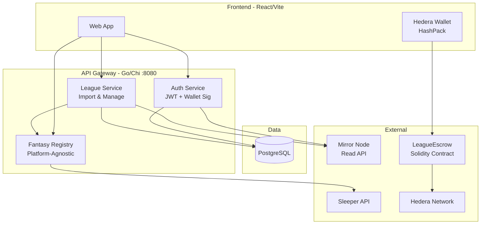

# WAGR

A Web3 application for managing payments for Fantasy sports leagues.

## Overview

WAGR enables fantasy sports league commissioners to collect entry fees and distribute payouts using blockchain technology. Users connect a Hedera wallet, import their league from a fantasy platform, configure entry fees and payouts, and manage their league through the WAGR dashboard.

## Technology Stack

- **Frontend**: React + Vite, TypeScript
- **Backend**: Go, Chi router
- **Database**: PostgreSQL
- **Blockchain**: Hedera (testnet)
- **Smart Contract**: Solidity 0.8.20, Hardhat

## Getting Started

```bash
# Start PostgreSQL
docker-compose up -d

# Start API Gateway (port 8080)
go run src/cmd/gateway/main.go

# Start frontend dev server (port 5173)
cd src/web && npm install && npm run dev
```

## Architecture



## Features

- **Wallet Auth**: Connect a Hedera wallet (HashPack); authenticate via message signing with JWT sessions; supports both ECDSA_SECP256K1 and ED25519 key types
- **League Import**: Link your Sleeper account and import a league into WAGR in three steps
- **League Management**: View all imported leagues, see member details, and remove leagues
- **Payout Configuration**: Commissioners set entry fees and payout structures — placement-based (1st, 2nd, 3rd) and/or weekly bonuses
- **Entry Fee Collection**: Members pay USDC entry fees through the LeagueEscrow smart contract via HashPack wallet; two-phase flow (allowance approval + contract call)
- **On-Chain Verification**: Backend verifies payments by reading contract state via Hedera Mirror Node — no trust placed in the frontend
- **League Cancellation & Refunds**: Commissioner can cancel a league; members claim their USDC refund directly from the contract; leagues can be reactivated, resetting refunded members to unpaid
- **Platform-Agnostic**: Fantasy provider abstraction supports adding ESPN and Yahoo alongside Sleeper

## Smart Contract

`contracts/src/LeagueEscrow.sol` — holds USDC in escrow per league.

| Function | Description |
|----------|-------------|
| `payEntryFee(bytes32 leagueId, uint256 amount)` | Member pays entry fee; USDC transferred from member to contract |
| `claimRefund(bytes32 leagueId)` | Member reclaims their fee when league is cancelled |
| `distributePayout(address[] recipients, uint256[] amounts)` | Owner distributes prize pool to winners |
| `emergencyWithdraw(address token, uint256 amount)` | Owner recovery for stranded funds |

The contract uses the Hedera Token Service (HTS) precompile (`0x0167`) to associate USDC at construction.

```bash
# Deploy to Hedera testnet
cd contracts && node scripts/deploy.mjs
```

## Platform Support

| Platform | Status |
|----------|--------|
| Sleeper | Implemented |
| ESPN | Stubbed |
| Yahoo | Stubbed |

## Planned

- Oracle Service — automated score fetching and standings verification
- HBAR payment path — entry fees and payouts in HBAR (USDC path is live; HBAR stubs exist)
- Payout distribution UI — commissioner interface to trigger `distributePayout` on-chain
