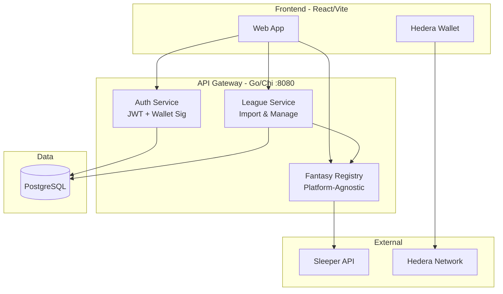

# WAGR

A Web3 application for managing payments for Fantasy sports leagues.

## Overview

WAGR enables fantasy sports league commissioners to collect entry fees and distribute payouts using blockchain technology. Users connect a Hedera wallet, import their league from a fantasy platform, configure entry fees and payouts, and manage their league through the WAGR dashboard.

## Technology Stack

- **Frontend**: React + Vite, TypeScript
- **Backend**: Go, Chi router
- **Database**: PostgreSQL
- **Blockchain**: Hedera (testnet)

## Getting Started

```bash
# Start PostgreSQL
docker-compose up -d

# Start API Gateway (port 8080)
go run src/cmd/gateway/main.go

# Start frontend dev server (port 5173)
cd src/web && npm install && npm run dev
```

## Architecture



## Features

- **Wallet Auth**: Connect a Hedera wallet; authenticate via message signing with JWT sessions
- **League Import**: Link your Sleeper account and import a league into WAGR in three steps
- **League Management**: View all imported leagues, see member details, and remove leagues
- **Payout Configuration**: Commissioners set entry fees and payout structures — placement-based (1st, 2nd, 3rd) and/or weekly bonuses
- **Platform-Agnostic**: Fantasy provider abstraction supports adding ESPN and Yahoo alongside Sleeper

## Platform Support

| Platform | Status |
|----------|--------|
| Sleeper | Implemented |
| ESPN | Stubbed |
| Yahoo | Stubbed |

## Planned

- Payment Service — entry fee collection via smart contracts
- Oracle Service — automated score fetching and standings verification
- Contract Manager — Hedera smart contract interactions
