# WAGR

A Web3 application for managing payments for Fantasy sports leagues.

## Overview

WAGR enables fantasy sports league commissioners to collect entry fees and distribute payouts using blockchain technology. The platform integrates with major fantasy sports platforms (ESPN, Yahoo, Sleeper) to automatically verify standings and trigger smart contract payouts.

## Technology Stack

- **Frontend**: React/Next.js
- **Backend**: Go microservices
- **Database**: PostgreSQL + Redis
- **Blockchain**: Ethereum Testnet / Cardano
- **Monitoring**: Prometheus/Grafana

## Architecture

```mermaid
graph TB
    subgraph "Frontend Layer"
        UI[React/Next.js Web App]
        MOBILE[Mobile App - Future]

        subgraph "UI Components"
            LC[League Creation Wizard]
            DASH[Dashboard & Standings]
            WALLET[Wallet Connection]
            PROFILE[User Profile]
        end
    end

    subgraph "API Layer - Go Services"
        GW[API Gateway Service<br/>Port: 8080]

        subgraph "Core Services"
            AUTH[Auth Service<br/>JWT & User Mgmt]
            LEAGUE[League Service<br/>CRUD Operations]
            PAYMENT[Payment Service<br/>Entry Fee Processing]
        end
    end

    subgraph "Background Services - Go"
        ORACLE[Oracle Service<br/>Score Fetching & Verification]
        SCHEDULER[Cron Scheduler<br/>Job Management]
        CONTRACT_MGR[Contract Manager<br/>Blockchain Interactions]

        subgraph "Oracle Workers"
            ESPN_WORKER[ESPN Worker]
            YAHOO_WORKER[Yahoo Worker]
            SLEEPER_WORKER[Sleeper Worker]
        end
    end

    subgraph "Data Layer"
        DB[(PostgreSQL Database)]
        REDIS[(Redis Cache)]

        subgraph "Database Tables"
            USERS[Users Table]
            LEAGUES_TBL[Leagues Table]
            MEMBERS[League Members]
            PAYOUTS[Payout Rules]
            TXN[Transactions Log]
            SCORES[Score Cache]
        end
    end

    subgraph "Blockchain Layer"
        TESTNET[Blockchain Network<br/>Ethereum Testnet/Cardano]

        subgraph "Smart Contracts"
            FACTORY[League Factory Contract<br/>Deploy New Leagues]
            LEAGUE_CONTRACT[League Contract Instance<br/>Per League]
            PAYOUT_CONTRACT[Payout Logic<br/>Distribution Rules]
        end
    end

    subgraph "External Services"
        ESPN_API[ESPN Fantasy API]
        YAHOO_API[Yahoo Fantasy API]
        SLEEPER_API[Sleeper API]
        WALLET_PROVIDER[Wallet Providers<br/>MetaMask, WalletConnect]
    end

    subgraph "Monitoring & DevOps"
        LOGGER[Logging Service<br/>Structured Logs]
        METRICS[Metrics & Monitoring<br/>Prometheus/Grafana]
        ALERTS[Alert System<br/>Discord/Email]
    end

    %% Frontend to API connections
    UI --> GW
    WALLET --> WALLET_PROVIDER
    UI --> TESTNET

    %% API Gateway to Services
    GW --> AUTH
    GW --> LEAGUE
    GW --> PAYMENT

    %% Services to Database
    AUTH --> DB
    LEAGUE --> DB
    PAYMENT --> DB
    ORACLE --> DB
    CONTRACT_MGR --> DB

    %% Services to Cache
    LEAGUE --> REDIS
    ORACLE --> REDIS

    %% Oracle to External APIs
    SCHEDULER --> ORACLE
    ORACLE --> ESPN_WORKER
    ORACLE --> YAHOO_WORKER
    ORACLE --> SLEEPER_WORKER

    ESPN_WORKER --> ESPN_API
    YAHOO_WORKER --> YAHOO_API
    SLEEPER_WORKER --> SLEEPER_API

    %% Contract Manager to Blockchain
    CONTRACT_MGR --> FACTORY
    CONTRACT_MGR --> LEAGUE_CONTRACT
    LEAGUE --> CONTRACT_MGR
    ORACLE --> CONTRACT_MGR

    FACTORY --> LEAGUE_CONTRACT
    LEAGUE_CONTRACT --> PAYOUT_CONTRACT

    %% Database relationships
    DB --> USERS
    DB --> LEAGUES_TBL
    DB --> MEMBERS
    DB --> PAYOUTS
    DB --> TXN
    DB --> SCORES

    %% Monitoring
    GW -.-> LOGGER
    ORACLE -.-> LOGGER
    CONTRACT_MGR -.-> LOGGER
    LOGGER -.-> METRICS
    METRICS -.-> ALERTS

    %% Styling
    classDef frontend fill:#e1f5ff,stroke:#01579b,stroke-width:2px
    classDef backend fill:#fff3e0,stroke:#e65100,stroke-width:2px
    classDef blockchain fill:#f3e5f5,stroke:#4a148c,stroke-width:2px
    classDef external fill:#e8f5e9,stroke:#1b5e20,stroke-width:2px
    classDef data fill:#fce4ec,stroke:#880e4f,stroke-width:2px
    classDef monitoring fill:#fff9c4,stroke:#f57f17,stroke-width:2px

    class UI,MOBILE,LC,DASH,WALLET,PROFILE frontend
    class GW,AUTH,LEAGUE,PAYMENT,ORACLE,SCHEDULER,CONTRACT_MGR,ESPN_WORKER,YAHOO_WORKER,SLEEPER_WORKER backend
    class TESTNET,FACTORY,LEAGUE_CONTRACT,PAYOUT_CONTRACT blockchain
    class ESPN_API,YAHOO_API,SLEEPER_API,WALLET_PROVIDER external
    class DB,REDIS,USERS,LEAGUES_TBL,MEMBERS,PAYOUTS,TXN,SCORES data
    class LOGGER,METRICS,ALERTS monitoring
```

## Features

- **League Management**: Create and manage fantasy sports leagues with customizable payout structures
- **Wallet Integration**: Connect MetaMask or WalletConnect for blockchain transactions
- **Multi-Platform Support**: Import leagues from ESPN, Yahoo, and Sleeper
- **Automated Payouts**: Smart contracts handle entry fee collection and winner distribution
- **Real-time Standings**: Oracle service fetches and verifies scores from fantasy platforms
